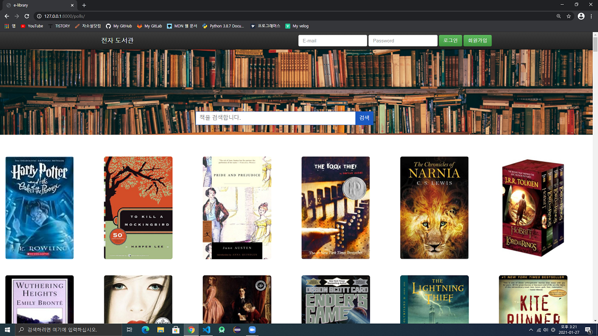

# 전자 도서관 홈페이지(웹 과제)

---

## 1. 구현한 기능

- 회원 가입
- ID/PW 찾기
- 회원정보 수정
- 회원 탈퇴
- 도서 검색

 

## 2. 메인 홈페이지

 

## 3. 참고사항

- 도서 정보(e.g. 이미지, 제목, 저자 등)는 kaggle에 존재하는 dataset 이용
- dataset 참고 링크 (https://www.kaggle.com/meetnaren/goodreads-best-books)
- 책 이미지는 kaggle에서 제공하는 image url을 사용했기 때문에, 서비스가 중단되면 이미지가 안 보일 수도 있다.